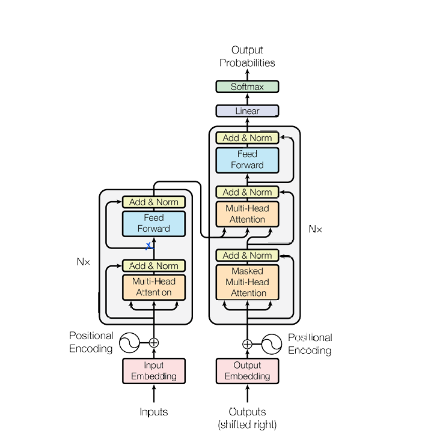
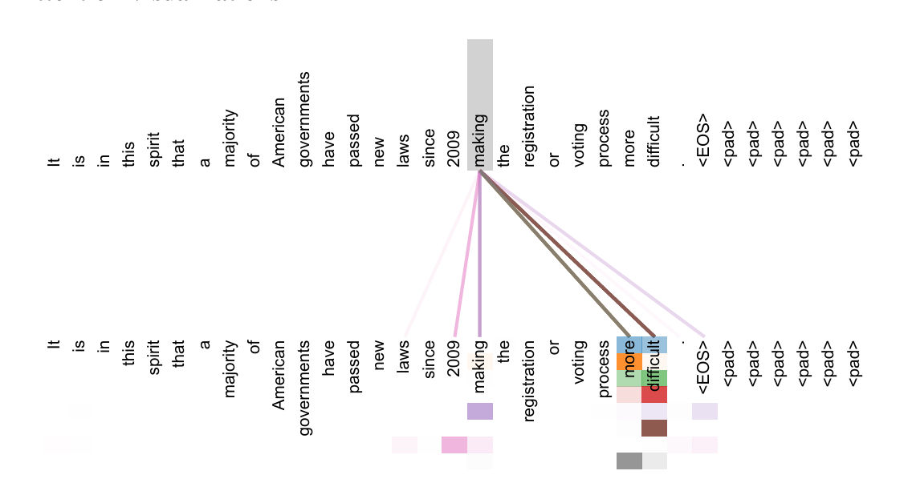

# Transformer From Scratch

A PyTorch reimplementation of the architecture proposed in **"Attention Is All You Need"** (Vaswani et al., 2017).
> **Paper**: [Vaswani et al., NeurIPS 2017](https://arxiv.org/abs/1706.03762)

---

## Table of Contents

- [Overview](#overview)
- [Architecture](#architecture)
- [Attention Visualization](#attention-visualization)
- [Dataset](#dataset)
- [Project Structure](#project-structure)
- [Setup and Installation](#setup-and-installation)
- [Training](#training)
- [Inference / Translation](#inference--translation)
- [Configuration](#configuration)
- [Implementation Notes](#implementation-notes)
- [Citation](#citation)

---

## Overview

## Architecture

The model follows the canonical encoder-decoder Transformer design:

<p align="center">
  
</p>

**Encoder** — Source tokens are embedded and combined with sinusoidal positional encodings, then passed through `N` identical layers. Each layer applies multi-head self-attention followed by a position-wise feed-forward network, with a residual connection and layer normalization wrapping each sub-layer.

**Decoder** — Target tokens are embedded and positionally encoded, then passed through `N` identical layers. Each layer applies (1) masked multi-head self-attention, where a causal mask prevents a position from attending to future tokens, (2) multi-head cross-attention over the encoder's output, and (3) a position-wise feed-forward network — again with residual connections and layer normalization around each sub-layer.

**Output head** — The decoder's final representations are projected to the target vocabulary size via a linear layer, followed by softmax to produce next-token probabilities.

```
Source Sentence                         Target Sentence (shifted right)
       |                                              |
       v                                              v
 Input Embedding                              Output Embedding
       |                                              |
       +-- Positional Encoding                Positional Encoding --+
       |                                              |
       v                                              v
  +---------------+                          +-------------------------+
  | Multi-Head    |  x N                     | Masked Multi-Head       |  x N
  | Self-Attention|                          | Self-Attention          |
  |   Add & Norm  |                          |   Add & Norm            |
  |               |                          | Multi-Head Cross-Attn   |
  | Feed Forward  |        encoder output -->|   (Q=decoder, K/V=enc)  |
  |   Add & Norm  |                          |   Add & Norm            |
  +---------------+                          | Feed Forward            |
                                              |   Add & Norm            |
                                              +-------------------------+
                                                          |
                                                          v
                                                       Linear
                                                          |
                                                          v
                                                       Softmax
                                                          |
                                                          v
                                                Output Probabilities
```

## Attention Visualization

<p align="center">
  
</p>

---

## Dataset

| Property | Value |
|---|---|
| Dataset | [Multi30k](https://huggingface.co/datasets/bentrevett/multi30k) (EN → DE) |
| Source loader | Hugging Face `datasets` |
| Tokenization | Lowercase whitespace split, custom `Vocab` class |
| Special tokens | `<pad>`, `<unk>`, `<sos>`, `<eos>` |
| Max sequence length | 128 tokens |
| Vocabulary cutoff | Tokens with frequency < 2 are mapped to `<unk>` |

Vocabularies are built once during training and pickled to `src_vocab.pkl` / `tgt_vocab.pkl`

---

## Project Structure

```
Transformer/
|
|-- model/
|   |-- attention/
|   |   |-- multihead_attention.py   # Scaled dot-product, multi-head attention
|   |
|   |-- blocks/
|   |   |-- encoder.py               # Stack of N encoder layers
|   |   |-- encoder_layer.py         # Self-attention + feed-forward sub-layers
|   |   |-- decoder.py               # Stack of N decoder layers
|   |   |-- decoder_layer.py         # Self-attn + cross-attn + feed-forward sub-layers
|   |   |-- feedforward.py           # Position-wise feed-forward network
|   |
|   |-- embeddings/
|   |   |-- positional_encoding.py   # Sinusoidal positional encoding
|   |
|   |-- transformer.py               # Full encoder-decoder model
|
|-- data/
|   |-- tokenizer.py                 # Vocab class + vocab builder
|   |-- dataset.py                   # Multi30k PyTorch Dataset
|   |-- collate.py                   # Batch padding / collate function
|
|-- utils/
|   |-- masking.py                   # Causal mask + padding mask utilities
|
|-- training/
|   |-- train.py                     # Training entrypoint
|   |-- translate.py                 # Inference / translation script
|
|-- docs/
|   |-- assets/                      # README images
|
|-- requirements.txt                 # Python dependencies
```

---

## Setup and Installation

**Requirements**: Python 3.8+, CUDA-capable GPU recommended for training.

```bash
git clone <this-repo-url>
cd Transformer
pip install -r requirements.txt
```

The Multi30k dataset is downloaded automatically via Hugging Face `datasets` the first time `training/train.py` is run; no manual download step is required.

---

## Training

From the project root:

```bash
python training/train.py
```

This will:

1. Download Multi30k and build source/target vocabularies, saving them to `src_vocab.pkl` and `tgt_vocab.pkl`
2. Train the Transformer logging to both the console and `training.log`
3. Evaluate on the validation split after every epoch
4. Save the best checkpoint (by validation loss) to `best_model.pt`

---

## Inference / Translation

Once a checkpoint and the corresponding vocab files exist:

```bash
python training/translate.py
```

```python
from training.translate import load_model_vocabs, translate

model, src_vocab, tgt_vocab = load_model_vocabs("best_model.pt")
print(translate("A dog is running in the park.", model, src_vocab, tgt_vocab))
```

---

## Configuration

All hyperparameters currently live as constants at the top of `training/train.py`:

| Parameter | Description | Default |
|---|---|---|
| `EMBED_DIM` | Model / embedding dimension | 512 |
| `NUM_HEADS` | Number of attention heads | 8 |
| `FF_DIM` | Feed-forward inner dimension | 2048 |
| `NUM_LAYERS` | Encoder and decoder layers | 6 |
| `DROPOUT` | Dropout probability | 0.1 |
| `MAX_LEN` | Max source/target sequence length | 128 |
| `BATCH_SIZE` | Training batch size | 128 |
| `NUM_EPOCHS` | Training # Transformer From Scratch


## Implementation Notes

- **Tokenization**: a simple lowercase whitespace splitter (`data/tokenizer.py`), not a subword tokenizer like BPE — sufficient for Multi30k's vocabulary size but a limiting factor on larger corpora.
- **Positional encoding**: fixed sinusoidal encodings (`sin`/`cos` of varying frequency) are added to embeddings rather than learned positional embeddings.

---

## Citation

```bibtex
@inproceedings{vaswani2017attention,
  author    = {Ashish Vaswani and Noam Shazeer and Niki Parmar and Jakob Uszkoreit and
               Llion Jones and Aidan N. Gomez and Lukasz Kaiser and Illia Polosukhin},
  title     = {Attention Is All You Need},
  booktitle = {Advances in Neural Information Processing Systems (NeurIPS)},
  year      = {2017}
}
```epochs | 1000 |
| `LEARNING_RATE` | Base learning rate (Adam) | 1e-4 |
| `CLIP` | Gradient clipping max norm | 1.0 |
| Optimizer | Adam (β1=0.9, β2=0.98, eps=1e-9) | — |
| LR schedule | Transformer warmup schedule (`warmup=450` steps) | — |

---

## Implementation Notes

- **Tokenization**: a simple lowercase whitespace splitter (`data/tokenizer.py`), not a subword tokenizer like BPE — sufficient for Multi30k's vocabulary size but a limiting factor on larger corpora.
- **Positional encoding**: fixed sinusoidal encodings (`sin`/`cos` of varying frequency) are added to embeddings rather than learned positional embeddings.

---

## Citation

```bibtex
@inproceedings{vaswani2017attention,
  author    = {Ashish Vaswani and Noam Shazeer and Niki Parmar and Jakob Uszkoreit and
               Llion Jones and Aidan N. Gomez and Lukasz Kaiser and Illia Polosukhin},
  title     = {Attention Is All You Need},
  booktitle = {Advances in Neural Information Processing Systems (NeurIPS)},
  year      = {2017}
}
```